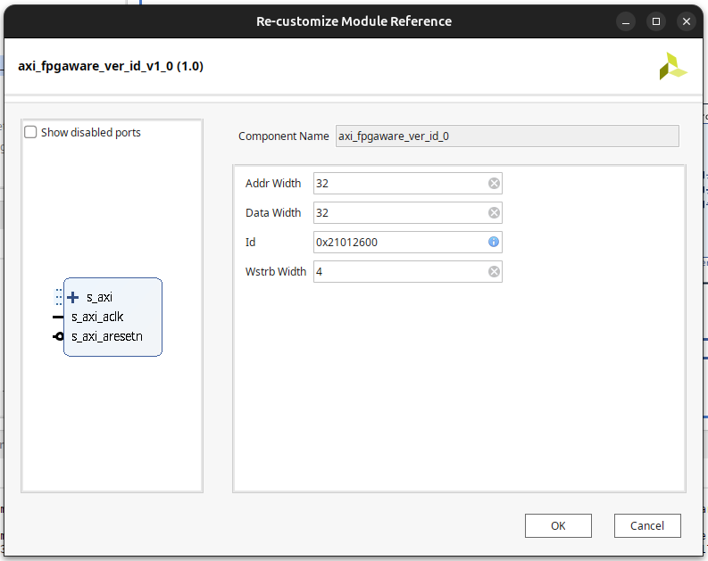
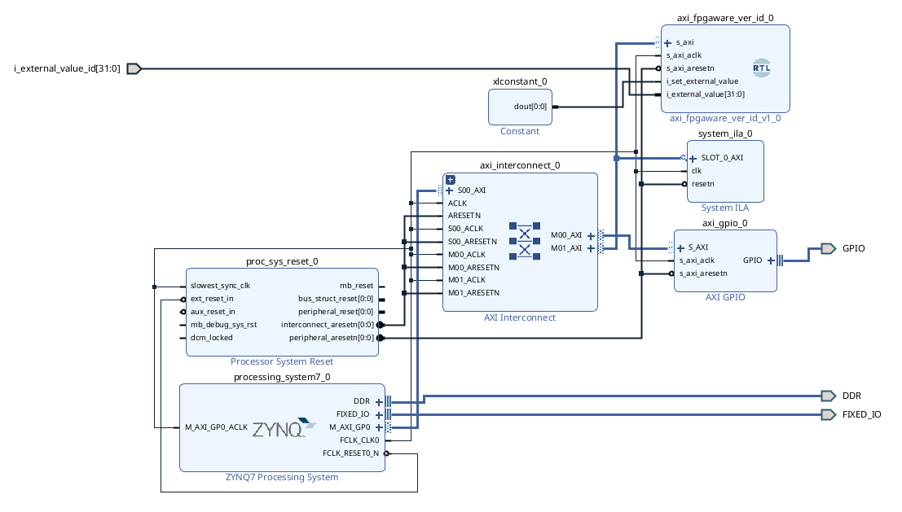
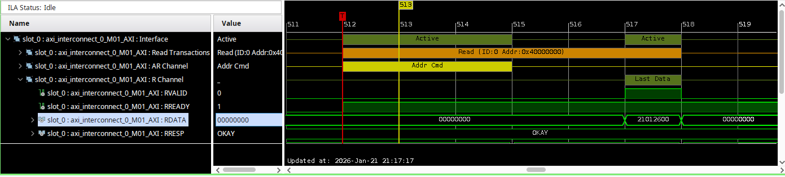

# axi_fpgaware_ver_id

## Description

Sometimes, during debugging, it's necessary to check the current version of an FPGA design using high-level software. **axi_fpgaware_ver_id** is IP-core that specifies the version or identifier in the Vivado design. This Ip-core have only one register - **0x00**. This register have ID value. Reading of the identification register is carried out via the **AXI4-Lite** bus.

You can set ID value in block design via parameter or from **i_external_value signal** (set signal **i_set_external_value** in high).

### Catalogs structure:
- doc - documents;
- sim - .do-files and .sh scripts for Modelsim/Questasim;
- src - source files;
- tb - testbenches;

